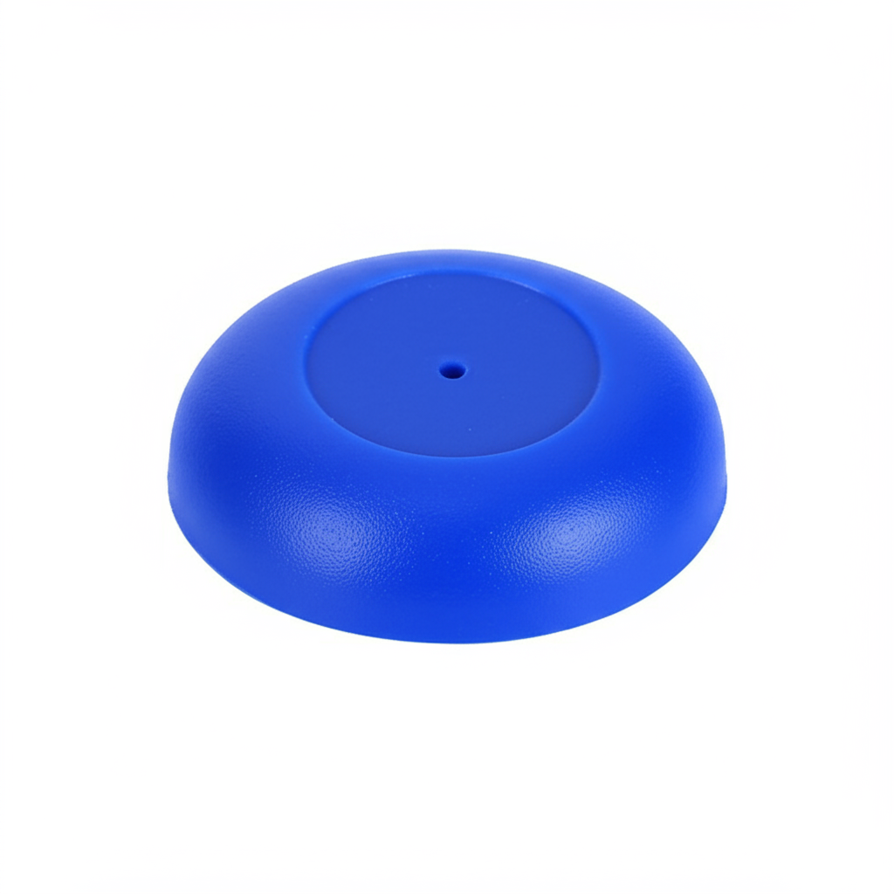
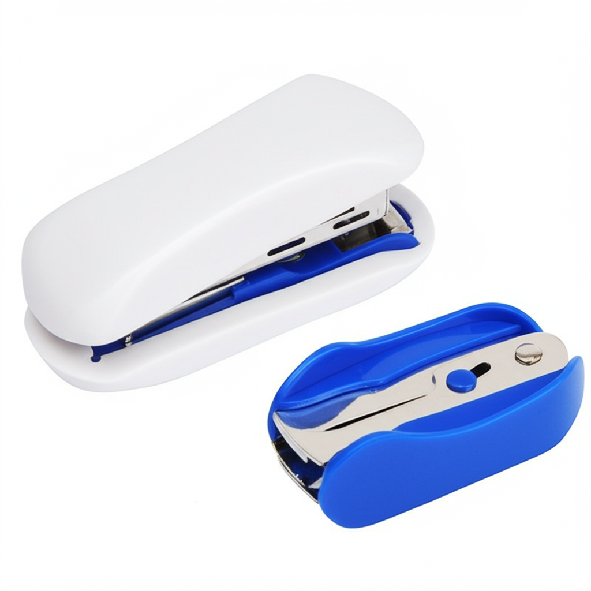
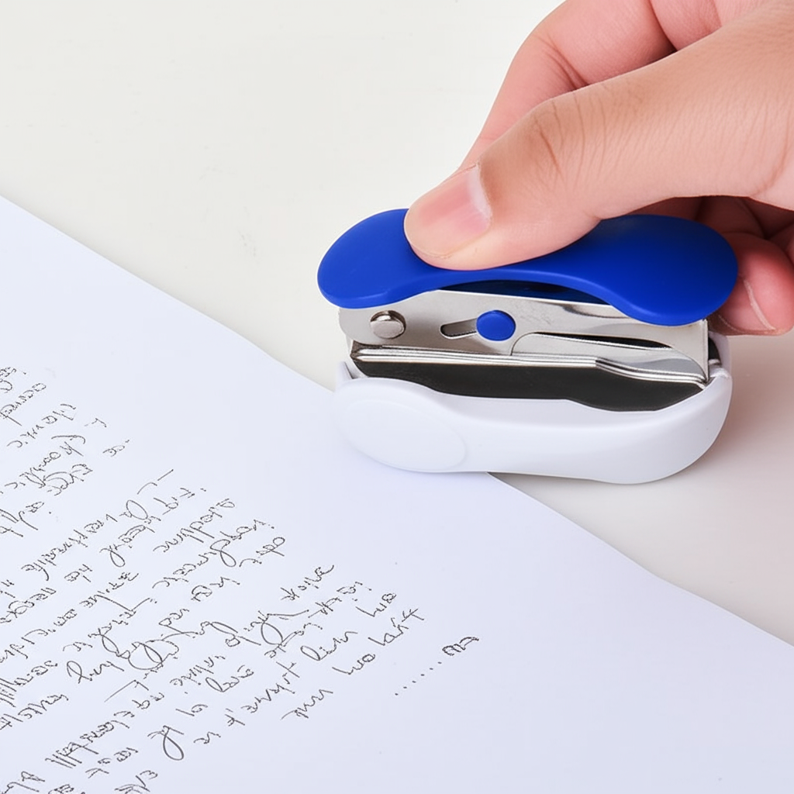

# 标题

- Deli 0232 Staple Remover: Dual-Purpose Tool for Effortless Staple Removal
- Heavy Duty Staple Remover: Easily Remove Small and Large Staples with Deli

# 描述

- **Effortless Staple Removal:** The Deli 0232 Staple Remover is designed to easily remove staples from documents, upholstery, and more, saving you time and effort.
- **Dual-Purpose Design:** This staple remover features a dual-purpose design, allowing you to remove both small and large staples with ease. No need for multiple tools!
- **Durable Construction:** Made from high-quality materials, the Deli 0232 Staple Remover is built to last, even with frequent use.
- **Comfortable Grip:** The ergonomic design provides a comfortable grip, reducing hand fatigue during extended use.
- **Versatile Application:** Perfect for use in the office, at home, or in the workshop, this staple remover is a versatile addition to any toolbox.

# 主图

# A Plus

Our Deli staplers are crafted for superior performance and lasting durability. Experience the difference with our precision engineering and ergonomic design, making every stapling task effortless and efficient. Choose Deli for reliable stapling solutions that stand the test of time.

